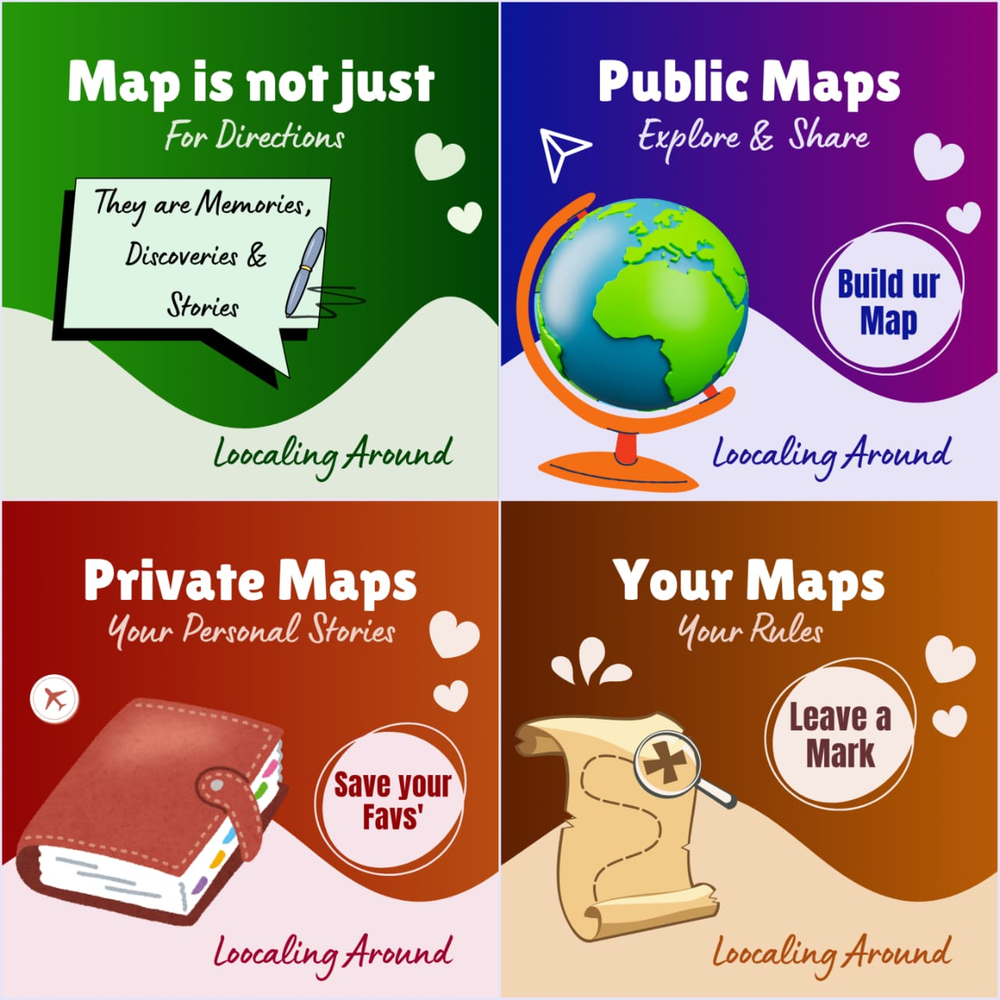
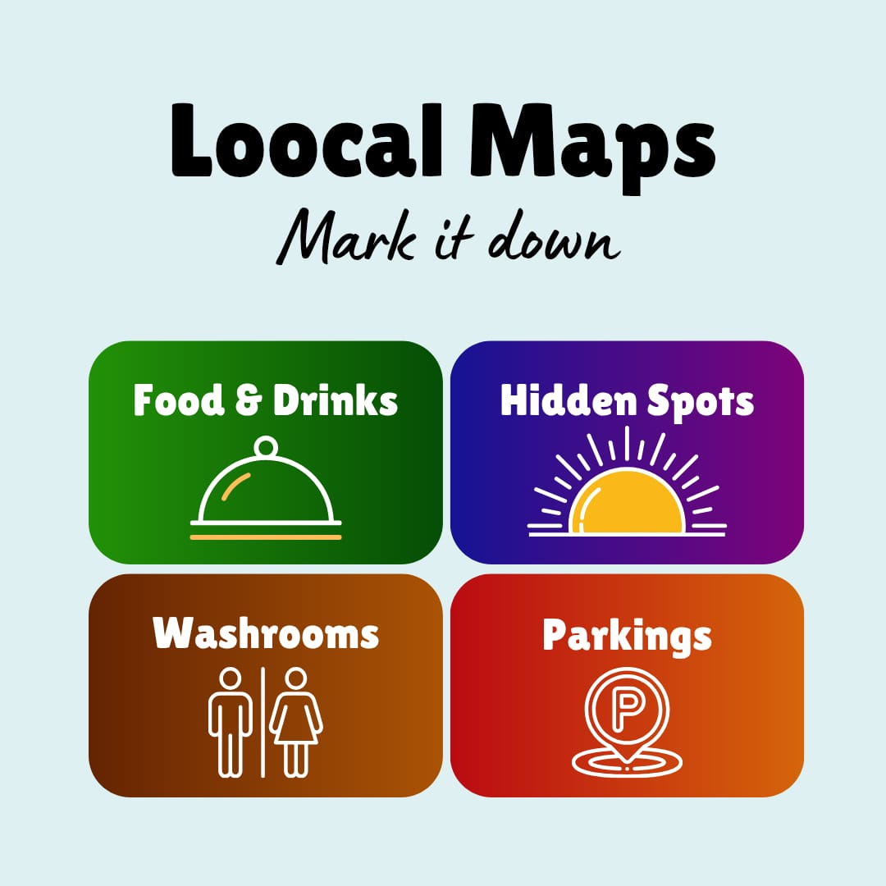
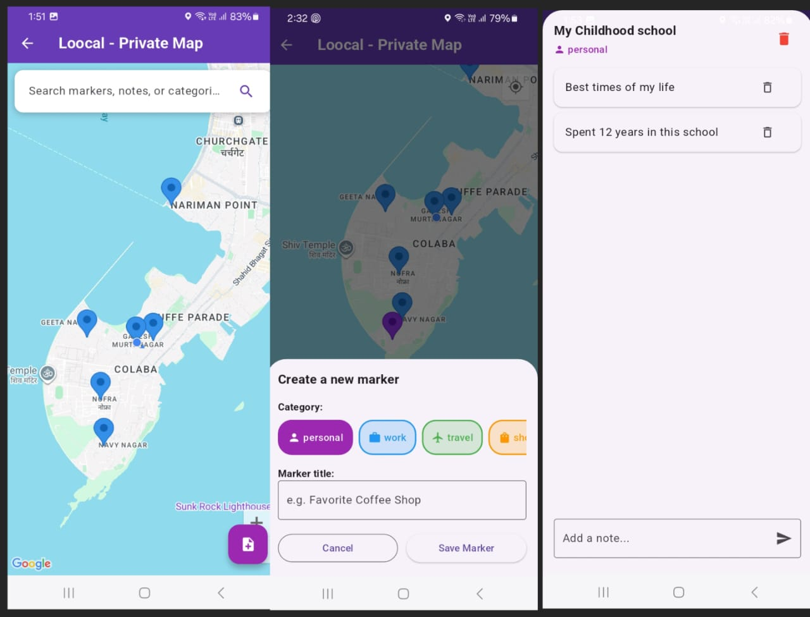
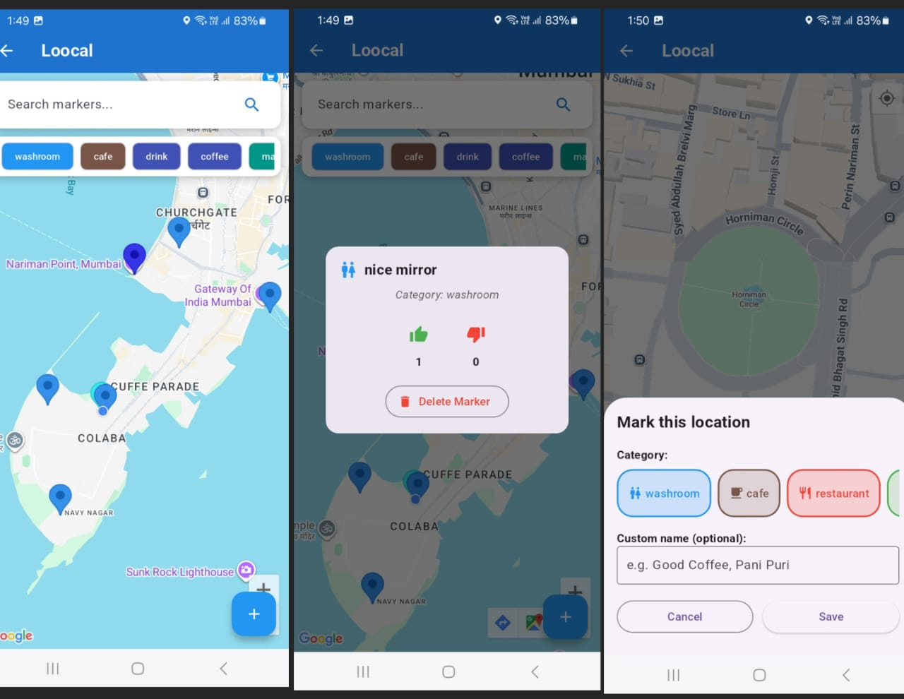

# Loocal - Flutter Map App


Loocal is a Flutter-based mobile app that allows users to create, view, and interact with **public and private map markers**. Users can mark locations, add notes, like/dislike markers, and manage their own private markers securely.  

---

## Home Screens

  
  


---

## Features

### Public Map
- Users can add markers visible to everyone.  
- Markers have a **title** and can be liked or disliked by other users.  
- Only the creator can delete their markers.  
- Real-time updates using **Firebase Firestore**.  

### Private Map
- Users can create markers visible only to themselves.  
- Each marker can have multiple notes.  
- Markers and notes are stored securely per user in Firestore.  
- Search functionality for marker titles and notes.  

### General Features
- Current location tracking using **Geolocator**.  
- Smooth map experience using **Google Maps Flutter plugin**.  
- Simple and intuitive UI.  

---

## Map Screens

  
  


---

## Download APK  

👉 [**Download the latest APK here**](https://github.com/Habiba-Ansari/Loocal/releases/latest)  

---

## Tech Stack

- **Flutter** – Frontend framework for cross-platform mobile apps  
- **Firebase Auth** – User authentication  
- **Cloud Firestore** – Database for storing markers and notes  
- **Google Maps Flutter** – Interactive map  
- **Geolocator** – Location services  

---

## Installation

1. Clone the repository:  
   ```bash
   git clone https://github.com/Habiba-Ansari/Loocal.git
   cd loocal
   flutter pub get
   flutter run
